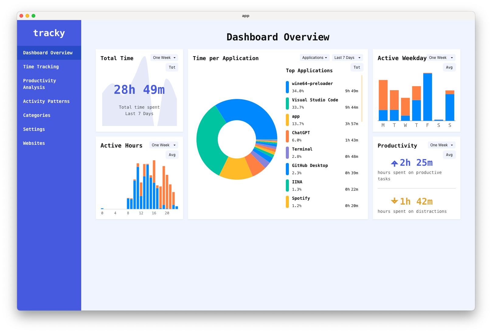

# Tracky
This is only an overview of the project (private repository, no code in this public repository).

Tech-stack:
- NodeJS
- React
- TypeScript
- CSS
- Python
- SQLite

Developed as a desktop application, in Tauri, for MacOs.

## Introduction

Tracky is a time-tracking and productivity analysis application designed to help users monitor and improve their digital habits. It tracks time spent on different applications, provides insights through visual analytics, and helps users categorize their activities as productive or unproductive or any other category. The goal is to give users a clear picture of how they spend their time.

---

## Dashboard Overview

The **Dashboard** offers a snapshot of the user's time usage across various applications and days. Key components include:

- **Total Time**: Displays the total time spent using applications over the last time period.
- **Time per Application**: A pie chart showing how time is distributed across applications, allowing users to see which apps consume the most time during the selected time period.
- **Top Applications**: A list of the most-used applications, ranked by time spent during the selected time period.
- **Active Weekdays**: A bar chart showing on which weekdays the user is most active, with a breakdown of productive vs unproductive time during the selected time period.
- **Active Hours**: Displays the user's active hours throughout the day in a bar chart format.
- **Productivity**: A summary of how much time is spent on productive tasks versus distractions 

---

## Categories

Tracky allows users to organize their applications into custom categories such as "Work," "Entertainment," and "Fun." Each application can be marked as either **productive** or **unproductive**, providing a clearer picture of how much time is spent on meaningful tasks versus distractions.

