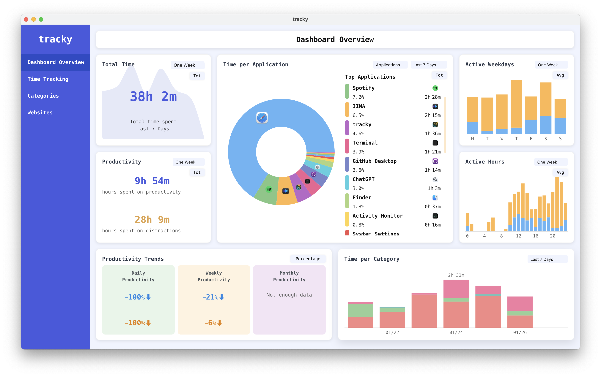
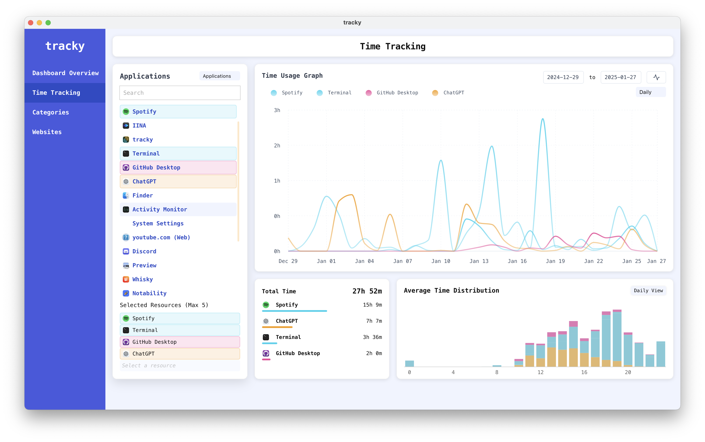
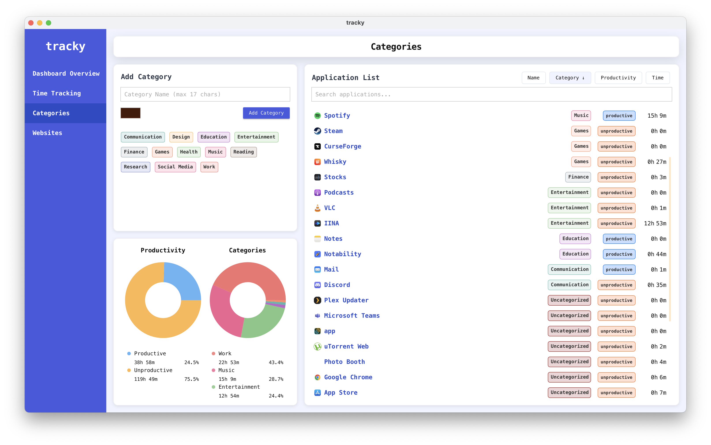

# Tracky
This is only an overview of the **ongoing** project (private repository, no code in this public repository).

Tech-stack:
- NodeJS
- React
- TypeScript
- CSS
- Python
- SQLite

Developed as a desktop application, in Tauri, for MacOs.

## Introduction

Tracky is a time-tracking and productivity analysis application designed to help users monitor and improve their digital habits. It tracks time spent on different applications, provides insights through visual analytics, and helps users categorize their activities as productive or unproductive or any other category. The goal is to give users a clear picture of how they spend their time.

---

